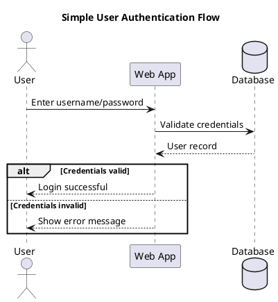

# H
## h2

```plantuml
@startuml
title Simple User Authentication Flow

actor User
participant "Web App" as App
database "Database" as DB

User -> App : Enter username/password
App -> DB : Validate credentials
DB --> App : User record

alt Credentials valid
    App --> User : Login successful
else Credentials invalid
    App --> User : Show error message
end

@enduml
    
```